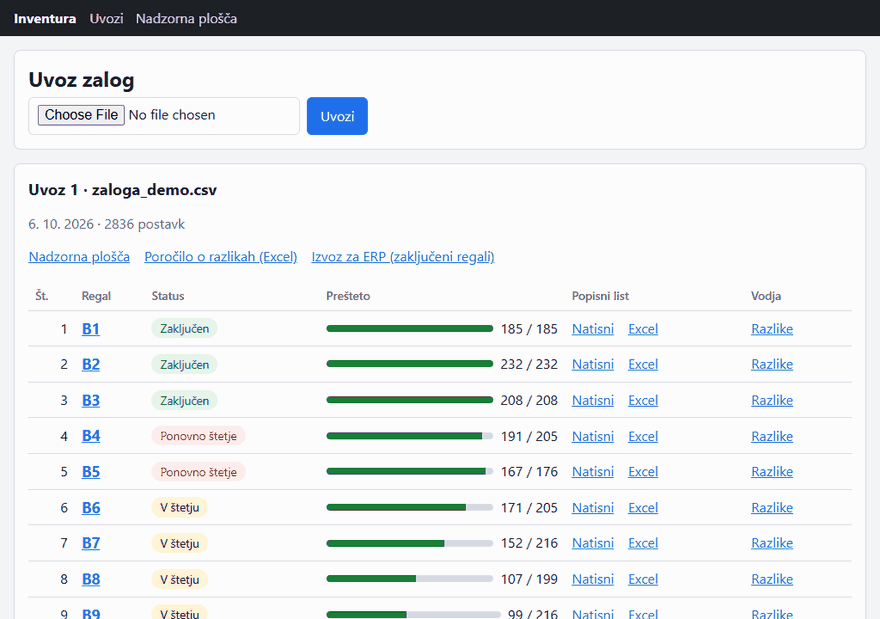
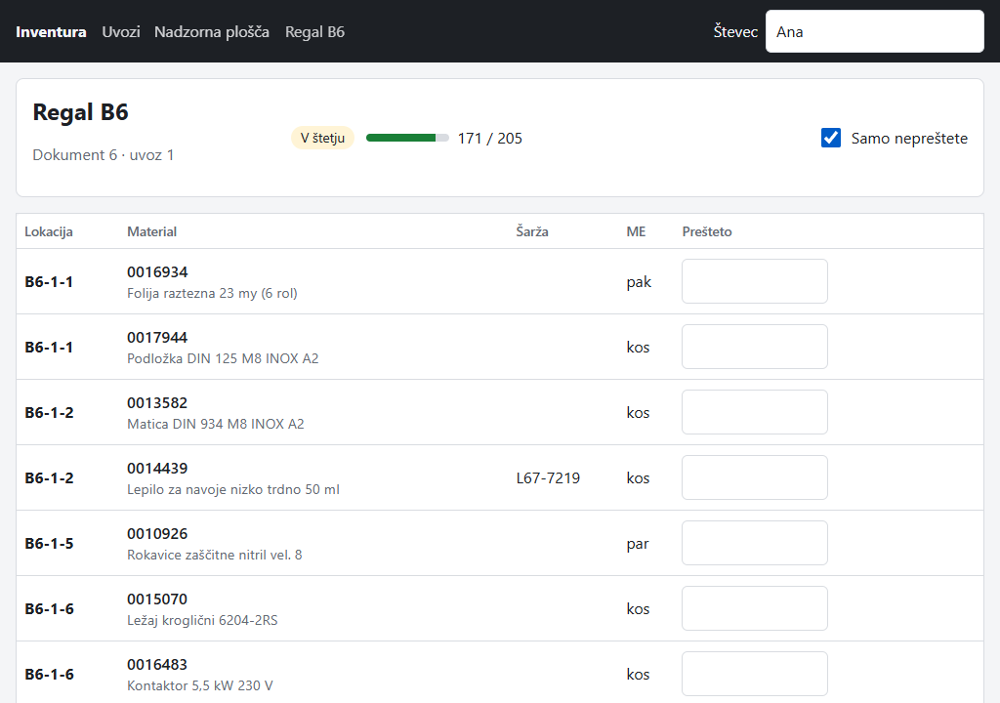
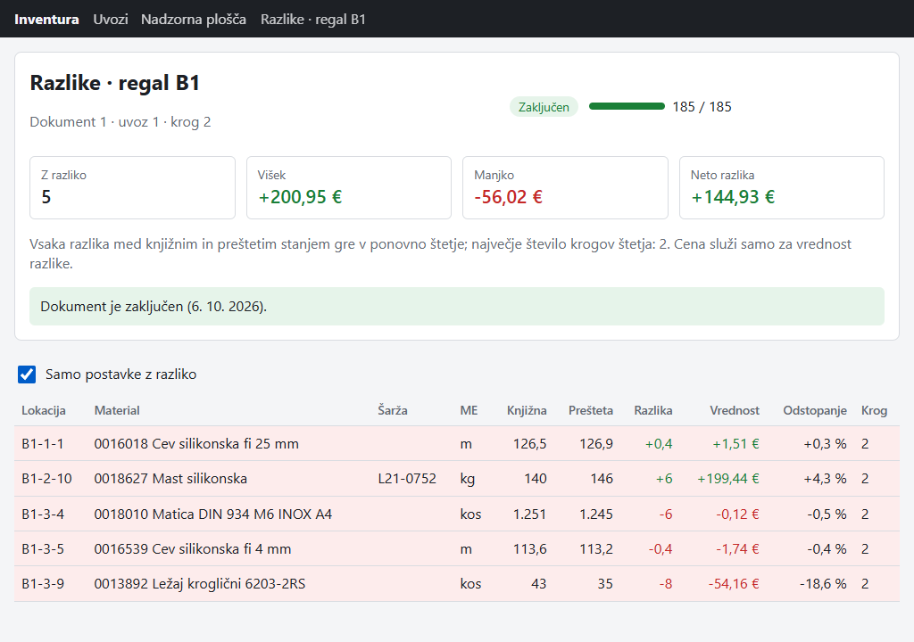
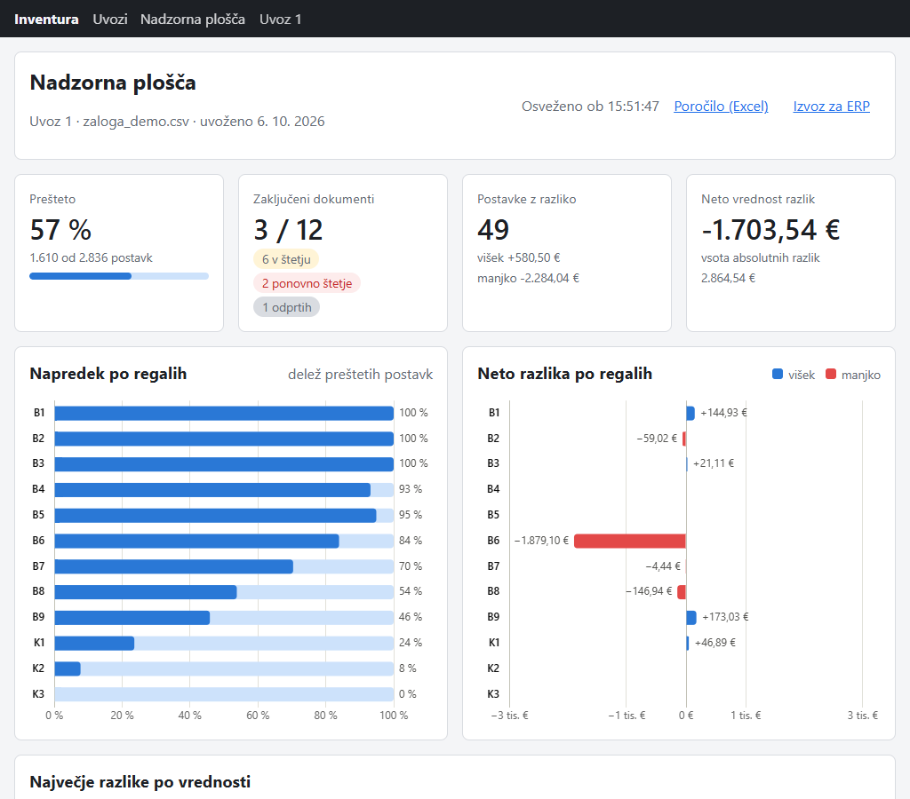

# Inventura Toolkit

*[English](README.md)*

Inventura v skladišču še vedno poteka prek preglednic in ročnega prepisovanja. To orodje
razdeli izvoz zalog na en popisni dokument na regal, zbira štetje na tablici in označi
razlike za ponovno štetje.

Pokrije del fizične inventure, ki poteka zunaj ERP: od izvoza zalog do popisnih listov,
štetja, razlik in ponovnega štetja ter do poročila, nadzorne plošče in datoteke CSV za
paketni vnos nazaj v ERP (na primer SAP MM).



*Vsi podatki v repozitoriju so izmišljeni, ustvari jih generator v projektu.*

## Kaj naredi

1. **Uvozi izvoz zalog** (CSV ali XLSX). Stolpci se povežejo prek preslikave v YAML, vsaka
   vrstica se preveri, napake se izpišejo po številkah vrstic.
2. **Razdeli po regalih.** En popisni dokument na regal, regali v naravnem vrstnem redu
   (B2 pred B10), postavke v vrstnem redu hoje. Tu se zamrzneta knjižna količina in cena.
3. **Popisni listi** v Excelu in kot stran za tisk na A4, privzeto za slepo štetje.
4. **Štetje na tablici.** Velika polja, vsaka količina se shrani posebej, Enter skoči na
   naslednjo postavko; dodati je mogoče blago, ki ga na polici najdeš, v knjigi pa ga ni.
   Namesto tega se lahko uvozi izpolnjen Excel popisni list.
5. **Razlike in ponovno štetje.** Vsaka razlika gre v drugi krog štetja; po zadnjem krogu
   se preštete količine sprejmejo in regal se zaključi.
6. **Rezultati:** poročilo v Excelu s pogojnim oblikovanjem, nadzorna plošča (napredek po
   regalih, največje razlike, skupna vrednost) in CSV za paketni vnos v ERP.

| Štetje na tablici | Razlike | Nadzorna plošča |
|---|---|---|
|  |  |  |

## Hiter začetek

Potrebuješ Docker.

```bash
docker compose up --build
```

Odpri <http://localhost:8000>. Ob prvem zagonu se izvedejo migracije in baza se napolni z
izmišljeno inventuro v teku: nekateri regali so zaključeni, nekateri v ponovnem štetju,
nekateri se še štejejo. Prijave ni (glej [Omejitve](#omejitve)). Dokumentacija API je na
<http://localhost:8000/docs>.

<details>
<summary>Za posrednikom ali protivirusnim programom, ki pregleduje HTTPS</summary>

Če gradnja ne more prenesti paketov (`invalid peer certificate: UnknownIssuer`), podaj
korenski certifikat posrednika ali protivirusnega programa. Zaupan je samo med gradnjo:

```bash
docker build --secret id=extra_ca,src=root-ca.pem -t inventura-toolkit .
docker compose up
```
</details>

## Odločitve pri zasnovi

- **En regal je en dokument.** Regal je tisto, kar en števec prehodi v enem obhodu;
  napredek, ponovno štetje in zaključek potekajo po regalih, ERP pa dobi en dokument na
  regal.
- **Knjižna količina in cena se zamrzneta** ob začetku štetja. Kasnejši uvoz ne sme
  spremeniti štetja v teku, razlika pa se mora meriti glede na to, kar je števec štel.
- **`Numeric`, nikoli `float`.** Količine so `Numeric(14,3)`, vrednosti `Numeric(14,2)`, v
  Pythonu `Decimal`, iz datotek prebrane kot besedilo. Zato projekt uporablja samo
  PostgreSQL, tudi v testih: SQLite nima decimalnega tipa.
- **Ni prešteto ni isto kot nič.** Prazno štetje pomeni »še ni prešteto«, 0 pomeni
  »prešteto, nič ni«; napredek in razlike to ločita.
- **Vsak krog je vrstica, razlike se ne shranjujejo.** Ponovno štetje doda vrstico; razlika
  se ob vsakem branju izračuna iz zadnjega kroga, zato se ne more razhajati s štetjem.
- **`NULLS NOT DISTINCT`** na unikatnem ključu postavk: šarža je pogosto prazna, dve
  vrstici brez šarže pa morata še vedno veljati za isto pozicijo.
- **Lokacije se razčlenijo.** `K2-03-11` in `K2-3-11` sta ista lokacija; regali se
  razvrščajo naravno; izvirni zapis ostane za prikaz.
- **Vsaka razlika gre v ponovno štetje.** Cena ne odloča, kaj se šteje znova; razliki da
  samo vrednost v poročilu.
- **HTMX namesto Reacta.** Strani, izrisane na strežniku, ne potrebujejo ločene gradnje
  frontenda in delujejo v brskalniku katere koli tablice. htmx in Chart.js streže
  aplikacija sama, zato štetje deluje tudi v omrežju skladišča brez interneta.
- **Vse ali nič.** Izvoz zalog ali izpolnjen popisni list z eno samo napako se zavrne v
  celoti, napake pa se izpišejo po vrsticah; nič se ne uvozi do polovice.
- **Poslovna pravila v `core/`**, paketu brez datotek, omrežja in baze, zato so preizkušena
  z navadnimi enotskimi in lastnostnimi testi.

Več v [arhitekturi](docs/architecture.sl.md), [podatkovnem modelu](docs/data-model.sl.md)
in [oblikah datotek](docs/file-formats.sl.md).

## Omejitve

- **Izvoz za ERP je simulacija oblike.** Posnema paketni vnos za ustvarjanje popisnih
  dokumentov in vnos štetja; povezave z ERP ni.
- **Brez prijave in vlog.** Vsak, ki ima dostop, vidi vse, tudi strani z razlikami, ki jih
  števci ne potrebujejo. Vloge (vodja inventure, števec) so načrtovana razširitev.
- **Eno skladišče, ena valuta (EUR).** Obrati in skladišča niso modelirani.
- **Popisni listi so v Excelu in HTML.** PDF iz iste predloge je načrtovana razširitev.

## Razvoj

Python 3.12 z [uv](https://docs.astral.sh/uv/), PostgreSQL 16 v Dockerju.

```bash
uv sync
docker compose up -d db          # PostgreSQL na localhost:5433
uv run alembic upgrade head
uv run inventura demo            # po želji: izmišljena inventura
uv run inventura serve           # http://localhost:8000
```

Preverjanja (enaka kot v CI):

```bash
uv run ruff check .
uv run ruff format --check .
uv run mypy src
uv run pytest
```

Testi uporabljajo ločeno bazo `inventura_test` v istem vsebniku; vsak test teče v
transakciji, ki se razveljavi.

| Ukaz | Kaj naredi |
|---|---|
| `inventura generate -o zaloga.csv` | izmišljen izvoz zalog (CSV ali XLSX), isti seed da iste podatke |
| `inventura import zaloga.csv` | preveri izvoz in izpiše napake po vrsticah |
| `inventura sheets zaloga.csv` | popisni listi (Excel + stran za tisk) brez baze |
| `inventura demo` | prazno bazo napolni z izmišljeno inventuro |
| `inventura report <id>` | poročilo o razlikah uvoza v Excelu |
| `inventura erp-export <id>` | paketni vnos v ERP (ZIP) za zaključene dokumente |
| `inventura serve` | zažene spletno aplikacijo |

Nastavitve so spremenljivke okolja s predpono `INVENTURA_`: `DATABASE_URL`,
`TEST_DATABASE_URL`, `COLUMN_MAPPING`, `VARIANCE_RULES`, `MAX_UPLOAD_BYTES`.
Nastavitveni datoteki sta `config/column_mapping.yaml` in `config/variance_rules.yaml`.

Posnetki zaslona in GIF nastanejo iz demo inventure z
`uv run --with playwright --with pillow python scripts/docs_media.py`.

### Struktura projekta

```text
src/inventura/
  core/        poslovna pravila brez I/O: lokacije, vrstice zalog, dokumenti, štetje,
               razlike, seštevanje za ERP
  io/          datoteke: uvoz, popisni listi, branje izpolnjenega lista, poročilo, izvoz za ERP
  db/          modeli SQLAlchemy in seje
  services/    primeri uporabe nad bazo
  web/         FastAPI: JSON API, strani Jinja2 + HTMX, statične datoteke
  cli.py       ukazi Typer
  generator.py izmišljeni podatki o zalogi
  demo.py      demo inventura
config/        preslikava stolpcev in pravila ponovnega štetja (YAML)
migrations/    Alembic
tests/         unit (core), io, integration (PostgreSQL), CLI
docs/          arhitektura, podatkovni model, oblike datotek; angleško in slovensko
```

## Tehnologije

Python 3.12, FastAPI, Pydantic v2, SQLAlchemy 2, Alembic, PostgreSQL 16, pandas,
openpyxl, PyYAML, Jinja2, HTMX, Chart.js, Typer, pytest, Hypothesis, Faker, ruff, mypy,
uv, Docker Compose, GitHub Actions.

## Licenca

[MIT](LICENSE)
