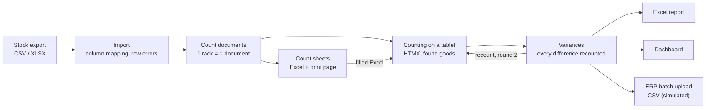
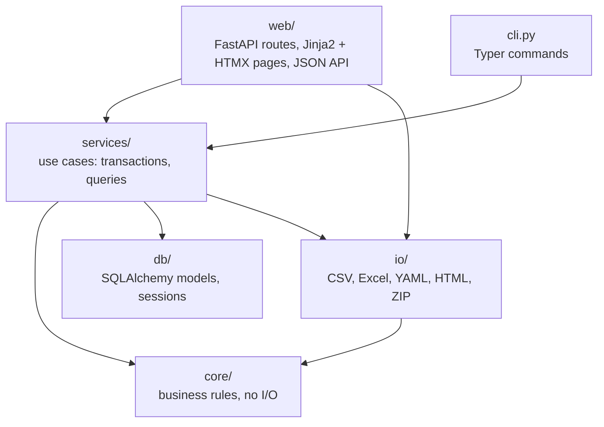

# Architecture

*[Slovenščina](architecture.sl.md)*

Inventura Toolkit is one FastAPI application with a PostgreSQL database. The business
rules live in a pure `core/` package; everything around it reads files, talks to the
database or renders pages.

## The flow

1. **Import.** A stock export (CSV or XLSX) is read with pandas, its columns are matched
   through `config/column_mapping.yaml`, and every row is validated. A file with any row
   error is rejected as a whole and the errors are listed by row number.
2. **Count documents.** Starting the count splits the stock into one document per rack,
   in natural rack order (B2 before B10), with items in walking order (level, position).
   The book quantity and the unit price are frozen into each item.
3. **Counting.** Counters enter quantities on a tablet, one row at a time, or fill the
   printed or Excel count sheet and import it. Goods found on a shelf without a book
   entry are added as found goods.
4. **Variances and recount.** Finishing a round sends every item with a difference to a
   new round; after the last round (`config/variance_rules.yaml`) the counts are accepted
   and the document is closed.
5. **Output.** An Excel report, a live dashboard and a CSV batch upload for an ERP.

## Layers

| Package | Responsibility | Examples |
|---|---|---|
| `core/` | All business rules as plain functions and dataclasses; no files, network or database | location parsing and natural sort, splitting by rack, quantity rules per unit, variances and recount, ERP aggregation |
| `io/` | Reading and writing files | stock import with column mapping, count sheets (Excel + HTML), filled sheet reader, Excel report, ERP ZIP |
| `db/` | Database schema and sessions | SQLAlchemy 2 models, `Numeric` columns, constraints |
| `services/` | Use cases that combine the core with the database | save a snapshot, create documents, record a count, finish a round, dashboard data |
| `web/` | HTTP: JSON API under `/api` and HTML pages | FastAPI routes, Pydantic schemas, Jinja2 templates, HTMX |
| `cli.py` | Batch work and demo data | `generate`, `import`, `sheets`, `report`, `erp-export`, `demo`, `serve` |

Because `core/` knows nothing about the database or the web, most rules are tested with
ordinary unit tests and property-based tests (Hypothesis), and the integration tests run
the same rules end to end against PostgreSQL.

## Request examples

**Saving a count on the tablet.** The quantity field sends `PATCH /items/{id}` when it
changes. The service locks the item and its document, checks the round and the quantity
rule, stores the value and returns the updated row plus the document progress as an
out-of-band HTMX swap. A validation error comes back in the same row, so nothing typed
is lost.

**Finishing a round.** `POST /api/documents/{id}/finish-round` checks that every item of
the latest round is counted, computes the variances from the counts (they are never
stored) and either inserts the next round for the items with a difference or closes the
document.

## Runtime

- `docker compose up` builds the image, starts PostgreSQL 16, runs the Alembic
  migrations and, on an empty database, adds a fictional demo inventory.
- htmx and Chart.js are served from the application itself, so counting and the
  dashboard work in a warehouse network without internet access.
- Settings come from environment variables with the prefix `INVENTURA_`
  (`DATABASE_URL`, `COLUMN_MAPPING`, `VARIANCE_RULES`, `MAX_UPLOAD_BYTES`).

## Tests and CI

- Unit tests for `core/` (including Hypothesis properties: sorting is stable, no item is
  lost or duplicated when splitting or exporting, quantities add up).
- I/O tests for every file format.
- Integration tests for the API and pages against a real PostgreSQL database (never
  SQLite: it has no decimal type). Each test runs in a rolled-back transaction.
- GitHub Actions: ruff, ruff format, mypy (strict), pytest with coverage on a PostgreSQL
  service container, and a Docker job that builds the image and smoke-tests
  `docker compose up`.
