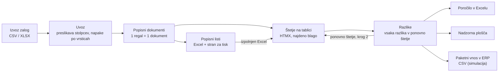
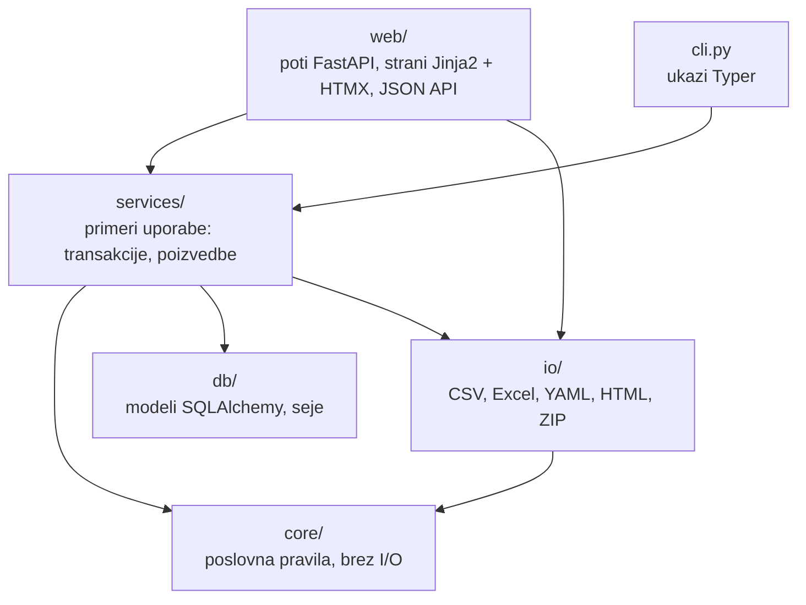

# Arhitektura

*[English](architecture.md)*

Inventura Toolkit je ena aplikacija FastAPI z bazo PostgreSQL. Poslovna pravila so v
čistem paketu `core/`; vse okoli njega bere datoteke, dela z bazo ali izrisuje strani.

## Potek

1. **Uvoz.** Izvoz zalog (CSV ali XLSX) se prebere s pandas, stolpci se povežejo prek
   `config/column_mapping.yaml` in vsaka vrstica se preveri. Datoteka z eno samo napako
   se zavrne v celoti, napake pa se izpišejo po številkah vrstic.
2. **Popisni dokumenti.** Začetek inventure razdeli zalogo na en dokument na regal, v
   naravnem vrstnem redu regalov (B2 pred B10) in s postavkami v vrstnem redu hoje
   (nivo, položaj). V vsako postavko se zamrzneta knjižna količina in cena na enoto.
3. **Štetje.** Števci vpisujejo količine na tablici, vrstico za vrstico, ali izpolnijo
   natisnjen oziroma Excel popisni list in ga uvozijo. Blago na polici, ki ga ni v knjigi,
   se doda kot najdeno blago.
4. **Razlike in ponovno štetje.** Zaključek kroga pošlje vsako postavko z razliko v nov
   krog; po zadnjem krogu (`config/variance_rules.yaml`) se preštete količine sprejmejo
   in dokument se zaključi.
5. **Izhodi.** Poročilo v Excelu, nadzorna plošča v živo in CSV za paketni vnos v ERP.

## Plasti

| Paket | Naloga | Primeri |
|---|---|---|
| `core/` | Vsa poslovna pravila kot navadne funkcije in podatkovni razredi; brez datotek, omrežja in baze | razčlenitev lokacij in naravno razvrščanje, delitev po regalih, pravila količin po merski enoti, razlike in ponovno štetje, seštevanje za ERP |
| `io/` | Branje in pisanje datotek | uvoz zalog s preslikavo stolpcev, popisni listi (Excel + HTML), branje izpolnjenega lista, poročilo v Excelu, ZIP za ERP |
| `db/` | Shema baze in seje | modeli SQLAlchemy 2, stolpci `Numeric`, omejitve |
| `services/` | Primeri uporabe, ki povežejo jedro z bazo | shranjevanje uvoza, ustvarjanje dokumentov, vpis štetja, zaključek kroga, podatki za nadzorno ploščo |
| `web/` | HTTP: JSON API pod `/api` in strani HTML | poti FastAPI, sheme Pydantic, predloge Jinja2, HTMX |
| `cli.py` | Paketno delo in demo podatki | `generate`, `import`, `sheets`, `report`, `erp-export`, `demo`, `serve` |

Ker `core/` ne ve ničesar o bazi ali spletu, je večina pravil preizkušena z navadnimi
enotskimi testi in lastnostnimi testi (Hypothesis), integracijski testi pa ista pravila
preverijo od začetka do konca na PostgreSQL.

## Primeri zahtev

**Shranjevanje štetja na tablici.** Polje za količino ob spremembi pošlje
`PATCH /items/{id}`. Storitev zaklene postavko in njen dokument, preveri krog in pravilo
količine, shrani vrednost ter vrne posodobljeno vrstico in napredek dokumenta kot
zamenjavo HTMX izven toka (out-of-band). Napaka se vrne v isti vrstici, zato se vpisana
vrednost ne izgubi.

**Zaključek kroga.** `POST /api/documents/{id}/finish-round` preveri, da so vse postavke
zadnjega kroga preštete, izračuna razlike iz štetja (nikoli se ne shranjujejo) in bodisi
doda nov krog za postavke z razliko bodisi zaključi dokument.

## Zagon

- `docker compose up` zgradi sliko, zažene PostgreSQL 16, izvede migracije Alembic in v
  prazno bazo doda izmišljeno demo inventuro.
- htmx in Chart.js streže aplikacija sama, zato štetje in nadzorna plošča delujeta tudi v
  omrežju skladišča brez dostopa do interneta.
- Nastavitve so v spremenljivkah okolja s predpono `INVENTURA_`
  (`DATABASE_URL`, `COLUMN_MAPPING`, `VARIANCE_RULES`, `MAX_UPLOAD_BYTES`).

## Testi in CI

- Enotski testi za `core/` (tudi lastnosti s Hypothesis: razvrščanje je stabilno, pri
  delitvi in izvozu se nobena postavka ne izgubi ali podvoji, količine se seštejejo).
- Testi I/O za vsako obliko datotek.
- Integracijski testi API in strani na pravi bazi PostgreSQL (nikoli SQLite: nima
  decimalnega tipa). Vsak test teče v transakciji, ki se razveljavi.
- GitHub Actions: ruff, ruff format, mypy (strict), pytest s pokritostjo na servisnem
  vsebniku PostgreSQL ter opravilo Docker, ki zgradi sliko in preizkusi
  `docker compose up`.
