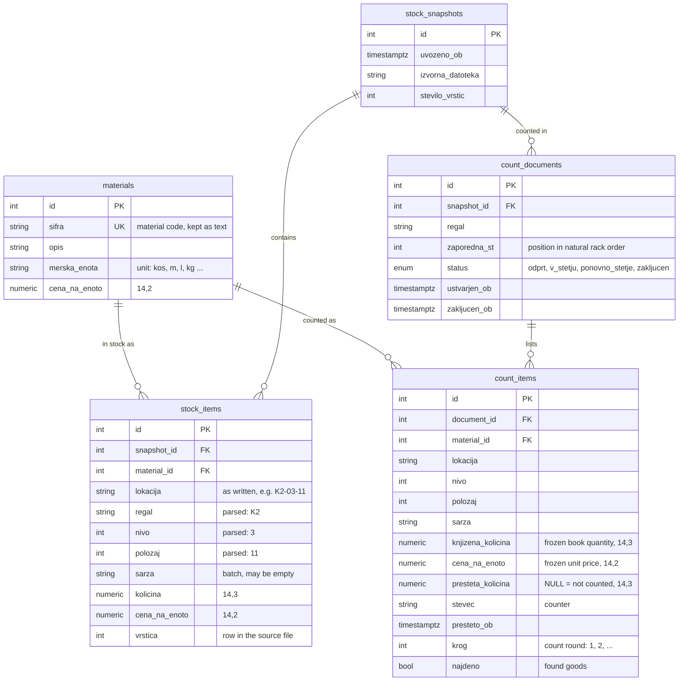

# Data model

*[Slovenščina](data-model.sl.md)*

PostgreSQL 16, migrated with Alembic (`migrations/`). Column names follow the domain
(Slovenian), table names are English.

## Tables

| Table | One row is | Notes |
|---|---|---|
| `materials` | a material in the master data | `sifra` is unique; description, unit and price follow the latest import |
| `stock_snapshots` | one imported stock export | stored only if every row is valid |
| `stock_items` | book stock of a material at a location, optionally in a batch | unique per snapshot, material, parsed location and batch |
| `count_documents` | the count of one rack in one snapshot | unique rack and number per snapshot |
| `count_items` | one position to count in one round | every round is a new row |

## Rules the schema enforces

- **No floats.** Quantities are `Numeric(14,3)` and money `Numeric(14,2)`; the application
  uses `Decimal` everywhere. This is also why the project uses only PostgreSQL, tests
  included: SQLite has no decimal type.
- **Frozen at the start of the count.** `count_items.knjizena_kolicina` and
  `cena_na_enoto` are copied when the documents are created. A later import updates
  `materials` and adds a new snapshot but does not touch a count in progress.
- **Not counted is not zero.** `presteta_kolicina` NULL means "not counted yet", 0 means
  "counted, nothing there". Progress counts both as counted; variances only exist for
  counted items. A check constraint keeps it non-negative.
- **Rounds are rows.** A recount adds a row with `krog` + 1 for the same position. The
  latest round is the row without a later one (a `NOT EXISTS` query that uses the unique
  index). Variances are computed from it on every read and never stored, so they cannot
  drift from the counts.
- **One row per position and round.** Unique key
  `(document_id, material_id, nivo, polozaj, sarza, krog)` with `NULLS NOT DISTINCT`:
  the batch is often empty, and without that clause two rows with an empty batch would
  not count as duplicates. The rack is the document's, so `nivo` and `polozaj` identify
  the location within it.
- **Locations compare by value.** `regal`, `nivo` and `polozaj` are parsed from the
  location as written, so `K2-03-11` and `K2-3-11` are the same location; `lokacija`
  keeps the original text for display.
- **Found goods.** `najdeno` marks goods found on a shelf without a book entry; a check
  constraint requires their book quantity to be 0. Only found goods can be deleted.
