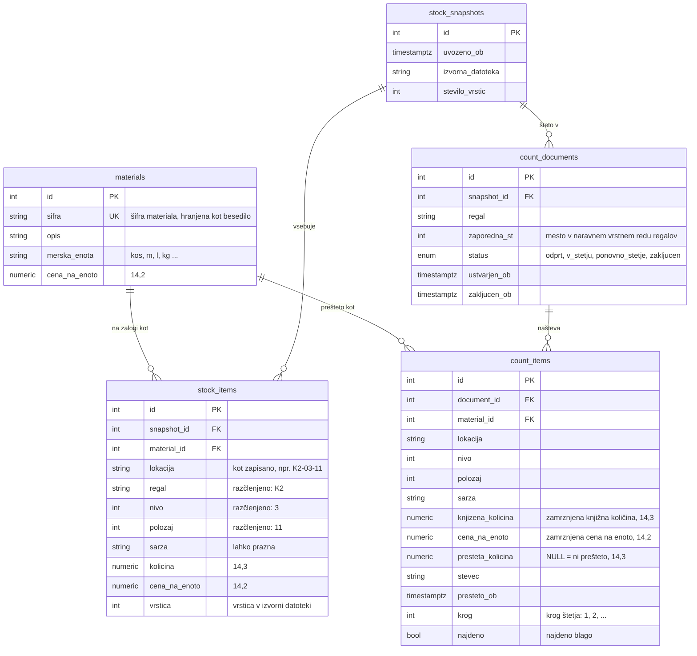

# Podatkovni model

*[English](data-model.md)*

PostgreSQL 16 z migracijami Alembic (`migrations/`). Imena stolpcev sledijo domeni
(slovensko), imena tabel so angleška.

## Tabele

| Tabela | Ena vrstica je | Opombe |
|---|---|---|
| `materials` | material v šifrantu | `sifra` je unikatna; opis, ME in cena sledijo zadnjemu uvozu |
| `stock_snapshots` | en uvožen izvoz zalog | shrani se samo, če so vse vrstice veljavne |
| `stock_items` | knjižna zaloga materiala na lokaciji, po potrebi v šarži | unikatna po uvozu, materialu, razčlenjeni lokaciji in šarži |
| `count_documents` | štetje enega regala v enem uvozu | regal in številka sta v uvozu unikatna |
| `count_items` | ena pozicija za štetje v enem krogu | vsak krog je nova vrstica |

## Pravila, ki jih zagotavlja shema

- **Brez float.** Količine so `Numeric(14,3)`, vrednosti `Numeric(14,2)`; aplikacija
  povsod uporablja `Decimal`. Zato projekt uporablja samo PostgreSQL, tudi v testih:
  SQLite nima decimalnega tipa.
- **Zamrznjeno ob začetku štetja.** `count_items.knjizena_kolicina` in `cena_na_enoto`
  se prepišeta ob ustvarjanju dokumentov. Kasnejši uvoz posodobi `materials` in doda nov
  uvoz, začetega štetja pa ne spremeni.
- **Ni prešteto ni isto kot nič.** `presteta_kolicina` NULL pomeni »še ni prešteto«, 0
  pomeni »prešteto, nič ni«. Napredek šteje oboje kot prešteto; razlike obstajajo samo za
  preštete postavke. Omejitev CHECK preprečuje negativne vrednosti.
- **Krogi so vrstice.** Ponovno štetje doda vrstico s `krog` + 1 za isto pozicijo. Zadnji
  krog je vrstica brez poznejše (poizvedba `NOT EXISTS`, ki uporabi unikatni indeks).
  Razlike se izračunajo iz njega ob vsakem branju in se nikoli ne shranijo, zato se ne
  morejo razhajati s štetjem.
- **Ena vrstica na pozicijo in krog.** Unikatni ključ
  `(document_id, material_id, nivo, polozaj, sarza, krog)` z `NULLS NOT DISTINCT`: šarža je
  pogosto prazna in brez tega dve vrstici s prazno šaržo ne bi veljali za podvojeni. Regal
  je določen z dokumentom, zato `nivo` in `polozaj` določata lokacijo v njem.
- **Lokacije se primerjajo po vrednosti.** `regal`, `nivo` in `polozaj` so razčlenjeni iz
  zapisane lokacije, zato sta `K2-03-11` in `K2-3-11` ista lokacija; `lokacija` hrani
  izvirni zapis za prikaz.
- **Najdeno blago.** `najdeno` označuje blago na polici brez knjižnega vnosa; omejitev
  CHECK zahteva, da je njegova knjižna količina 0. Izbrisati je mogoče samo najdeno blago.
